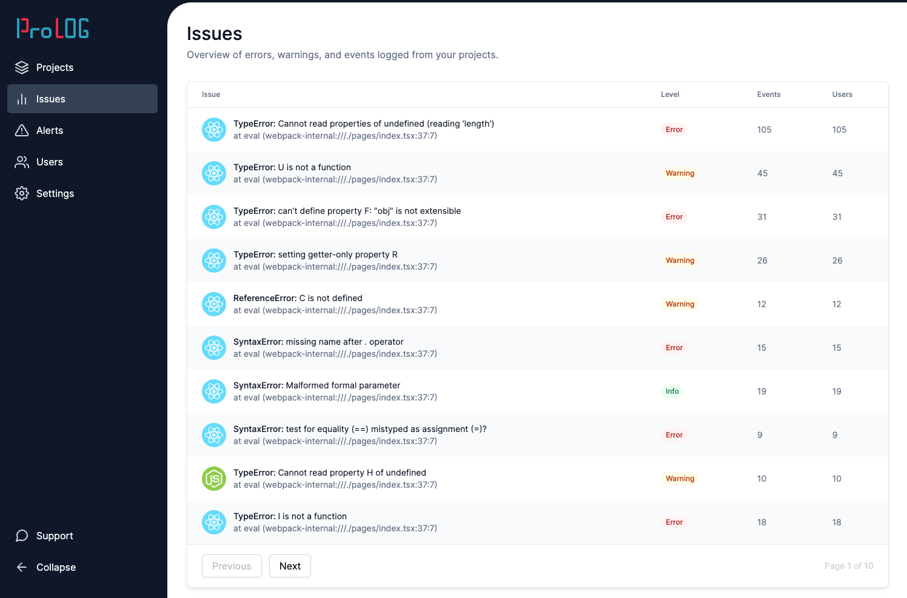
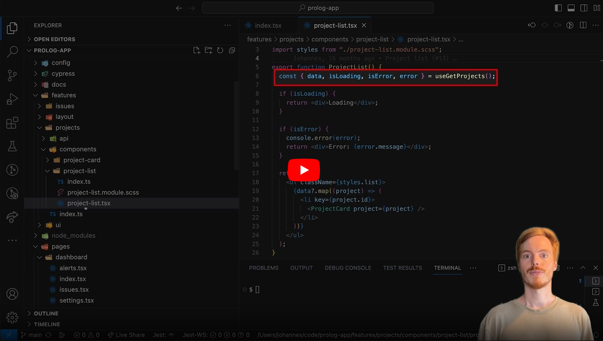

This repository is part of the [React Job Simulator](https://profy.dev) where you work in a professional dev environment with advanced tooling and workflows. You implement tasks based on designs starting from small bug fixes to full-blown features. Basically, you learn a lot of the things hands-on that you usually only experience once you joined a professional React team.

## The Application

The application is an error logging and monitoring tool similar to Sentry or Rollbar. You can find a deployed version of the main branch at [prolog.profy.dev](https://prolog.profy.dev). Note: you have to click the "Dashboard" link in the upper right corner to see the app as shown in the screenshot below.



## Codebase Tour

Watch this video for a tour through the codebase.

[](https://youtu.be/nYEZ1vVGYkw)

## Getting Started

### 1. Clone & Install

This project is built with Next.js, TypeScript, Cypress & SCSS modules among others. To start working on the project, first clone the repository on your local machine and install the dependencies.

```bash
npm install
```

### 2. Create .env File

**copy the `.env.template` file to a new file called `.env`.** This file contains the required environment variables that are injected by Next.js via the `dotenv` package.

### 3. Run Development Server

Finally, run the development server:

```bash
npm run dev
```

Now you can open [http://localhost:3000](http://localhost:3000) with your browser to see the application.

## Recommended VS Code Extensions

This project uses tools like ESLint, Stylelint, and Prettier. To make the most of these tools it's recommended to install the corresponding extensions. For VS Code those are:

- [ESLint](https://marketplace.visualstudio.com/items?itemName=dbaeumer.vscode-eslint)
- [Stylelint](https://marketplace.visualstudio.com/items?itemName=stylelint.vscode-stylelint)
- [Prettier](https://marketplace.visualstudio.com/items?itemName=esbenp.prettier-vscode)
- [SCSS IntelliSense](https://marketplace.visualstudio.com/items?itemName=mrmlnc.vscode-scss) (e.g. for auto-completion of SCSS variables)
- [React CSS modules](https://marketplace.visualstudio.com/items?itemName=viijay-kr.react-ts-css) (e.g. to open the CSS class definition with CMD/Ctrl + click and warn about non-existent class names)

The official Stylelint extension might need some adjustment of your `settings.json` file. If it doesn't work out of the box try adding these lines:

```
"css.validate": false,
"less.validate": false,
"scss.validate": false,
"stylelint.validate": ["css", "scss"],
```

Additional extensions that I find very valuable are

[Code Spell Checker](https://marketplace.visualstudio.com/items?itemName=streetsidesoftware.code-spell-checker)
[GitLens](https://marketplace.visualstudio.com/items?itemName=eamodio.gitlens)
[SVG](https://marketplace.visualstudio.com/items?itemName=jock.svg)
[GitHub Copilot](https://marketplace.visualstudio.com/items?itemName=GitHub.copilot) (paid)

## Tests

This project is covered with Cypress tests. Although most tests for production apps are currently written with React Testing Library, Cypress is the best option to get started with testing. When you're new to testing the start can be very cumbersome and feel like you're in a completely new dev environment.

Cypress makes it much easier to get started with testing. You still have to get used to the new way of coding but thanks to its awesome UI debugging is easy and very similar to what you're used from your browser.


To run the Cypress tests on your local machine use this command:

```bash
npm run cypress
```

## Storybook

Storybook is a great tool to document your components and visually test them in isolation. To open Storybook run

```bash
npm run storybook
```
